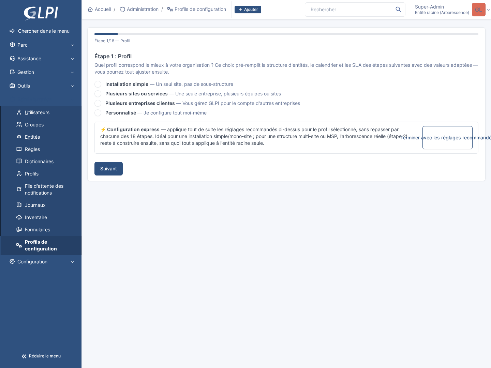
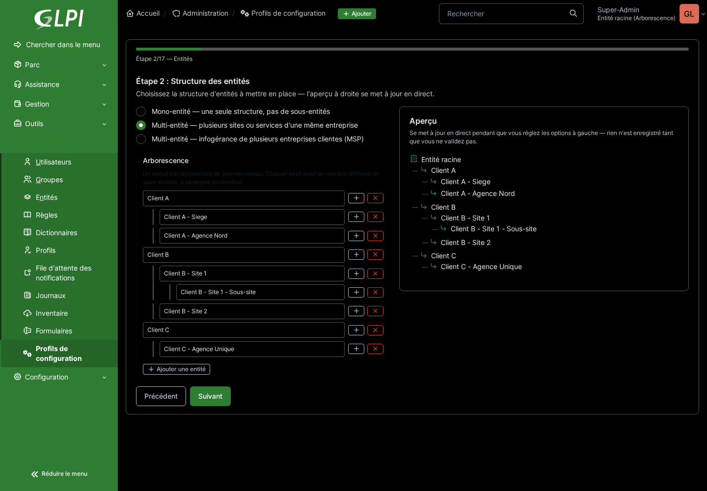

# Configuration GLPI Auto

[](https://www.gnu.org/licenses/gpl-3.0)
[](https://php.net)
[](https://glpi-project.org)
[](https://github.com/parime/Configuration-glpi-auto/actions)
[](https://github.com/parime/Configuration-glpi-auto/releases)

[🇫🇷 Français](README.md) | 🇬🇧 **English**

<p align="center"><strong>A brand-new GLPI instance, configured to ITIL/ISO 27001 best practices, in 18 guided steps instead of days of manual tweaking.</strong></p>

Configuration GLPI Auto is a GLPI plugin that aims to turn a blank installation into an operational platform in just a few clicks.

A fresh GLPI install is a blank page: no entities, no calendar, no SLAs, no ticket categories, no templates. Configuring all of that correctly by hand, while following ITIL best practices and ISO 27001 requirements, typically takes a newcomer administrator several days, with the risk of missing something important (SLA escalation, document classification, per-site rights...). This plugin condenses that work into a guided 18-step wizard: you answer questions about your organization, the wizard builds the matching configuration, and nothing is created in GLPI until you confirm the final summary.

> See [CHANGELOG.md](CHANGELOG.md) for the release history (the "Latest Release" badge above
> shows the most recent one) and [ROADMAP.md](ROADMAP.md) for what's planned.

📖 **[See the full tutorial](docs/TUTORIAL.md)**: all 18 wizard steps, one screenshot per step
(available in French and English).

## Table of contents

- [What sets it apart](#what-sets-it-apart)
- [Screenshots](#screenshots)
- [Features](#features)
- [Requirements](#requirements)
- [Installation](#installation)
- [Usage](#usage)
- [Documentation](#documentation)
- [Contributing](#contributing)
- [License](#license)

## What sets it apart

- **Nothing is created until the end**: the 18 steps only build up a configuration in memory, with a live-updating preview (see screenshot below); you can go back, change anything, start over, without ever touching GLPI before confirming the final summary.
- **An express mode for the impatient**: a single click at step 1 applies the chosen profile's recommended settings directly, without going through the following 17 steps one by one: for a simple installation, an operational GLPI instance in a few seconds.
- **Built for multi-site and MSP from the start**: the same entity tree, the same SLAs and the same visual customization can be differentiated per site or per client, without juggling several separate GLPI installations.
- **ISO 27001 compliance built in**: knowledge base document topics and criticality levels are offered right in the wizard, not bolted on afterwards by digging through GLPI's documentation.
- **No orphaned data**: every setting the wizard proposes (categories, statuses, templates...) is immediately usable: the service catalog generated in step 7 already routes automatically to the right category created in step 6, for example.

## Screenshots

**The starting profile choice**: four predefined profiles pre-fill the following 17 steps with values suited to your organization, freely adjustable afterwards; an express mode applies the recommended settings directly without going through every step:



**The entity structure, with a live preview**: single-site, multi-site or MSP: the tree is built on the left, the preview on the right updates with every change, before anything is saved:



All other screenshots (all 18 steps in detail) are in the [tutorial](docs/TUTORIAL.md).

## Features

- An 18-step graphical wizard with a progress bar and an express mode (applies the recommended
  settings directly, without going through every step)
- 4 predefined profiles (Simple install, Multiple sites or departments, Multiple client companies
  / MSP, Custom) that pre-fill the following steps with values suited to each
- Entity structure (single-site, multi-site, or MSP) with a real-time preview
- Calendar, SLA/OLA with automatic escalation between support tiers (L1 -> L2 -> L3)
- Topic-based ticket categories (11 selectable branches, up to 3 levels) and a self-service
  catalog (native GLPI 11 forms, automatic routing to the right category)
- Asset statuses and pending reasons with automatic follow-up/closure
- Visual customization: color and logo, native or custom GLPI palette, settings differentiated
  per client/site in MSP mode
- Ticket templates (simplified / full) automatically assigned based on the user's GLPI profile,
  LDAP rights (per site and per role/department)
- Libraries of task, solution, follow-up and validation templates, with dynamic Twig variables
  (real ticket/requester data), change and problem templates
- Locations, manufacturers, knowledge base categories, document topics (ISO 27001 classification)
  and criticality levels, Projects module dropdowns
- Interface translated into 5 languages (French, English, German, Italian, Spanish)

## Requirements

- PHP 8.2+
- GLPI 11.0+
- Database: MySQL 5.7+, MariaDB 10.2+, PostgreSQL 9.6+

## Installation

No Composer package (GLPI isn't distributed via Packagist, see CHANGELOG.md). Two options:

### From a release

1. Download the archive from [GitHub Releases](https://github.com/parime/Configuration-glpi-auto/releases)
2. Extract it into GLPI's `plugins/` folder (it already contains `vendor/`, ready to use)
3. Install and activate it via the GLPI interface or `bin/console plugin:install|activate configurationglpiauto`

### From source

```bash
git clone https://github.com/parime/Configuration-glpi-auto.git
cd Configuration-glpi-auto
composer install --no-dev   # vendor/autoload.php est requis au runtime, voir setup.php
```

Then copy/symlink the folder into `plugins/configurationglpiauto` of a GLPI 11 instance, and
install/activate it as above. A test Docker stack (GLPI + MariaDB) is provided in
`docker-compose.test.yml`.

## Usage

Once the plugin is active, the wizard is available from **Configuration > Configuration
profiles > Configuration**. Choose a starting profile (step 1), then go through the 18 steps,
adjusting each setting to your needs; nothing is created in GLPI before the last step (Summary).
Express mode (a button available from step 1) applies the chosen profile's recommended settings
directly, without going through every step. See the [tutorial](docs/TUTORIAL.md) for a screenshot
of each step.

## Documentation

- [Tutorial](docs/TUTORIAL.md): a step-by-step walkthrough of the wizard's 18 steps, with a
  screenshot of each.
- [CHANGELOG.md](CHANGELOG.md) and [ROADMAP.md](ROADMAP.md) for the technical detail of each
  feature.

## Contributing

Contributions are welcome! Please read [CONTRIBUTING.md](CONTRIBUTING.md) for the guidelines.

## License

GPLv3 - See [LICENSE](LICENSE) for details.
