# Tutoriel — Utilisation de l'assistant

Ce tutoriel parcourt les 17 étapes de l'assistant de configuration, avec une capture d'écran de
chacune. Les captures ci-dessous montrent le profil **« Plusieurs sites ou services »** — les
autres profils (Installation simple, Plusieurs entreprises clientes/MSP, Personnalisé)
pré-remplissent les mêmes étapes différemment, mais la structure du parcours est identique.

À tout moment, vous pouvez revenir en arrière avec **Précédent** sans perdre vos réponses : rien
n'est enregistré dans GLPI avant l'étape 17 (Récapitulatif).

## Étape 1 — Profil

Le point de départ : quatre profils prédéfinis (PME/ETI mono-site, plusieurs sites ou services,
plusieurs entreprises clientes/MSP, ou personnalisé). Le choix pré-remplit la structure d'entités,
le calendrier et les SLA des étapes suivantes avec des valeurs adaptées — tout reste ajustable
ensuite. Un bouton **mode express** permet aussi de valider directement avec les valeurs par
défaut du profil choisi, sans parcourir les 17 étapes une à une.

## Étape 2 — Entités

Construit l'arborescence d'entités : mono-entité, multi-site (une entreprise, plusieurs
sites/équipes), ou MSP (plusieurs entreprises clientes distinctes). Un nœud par site, profondeur
libre — l'aperçu à droite se met à jour en direct.

## Étape 3 — Calendrier

Horaires d'ouverture et jours fériés français, utilisés ensuite par les SLA pour calculer les
délais réels (hors horaires non ouvrés).

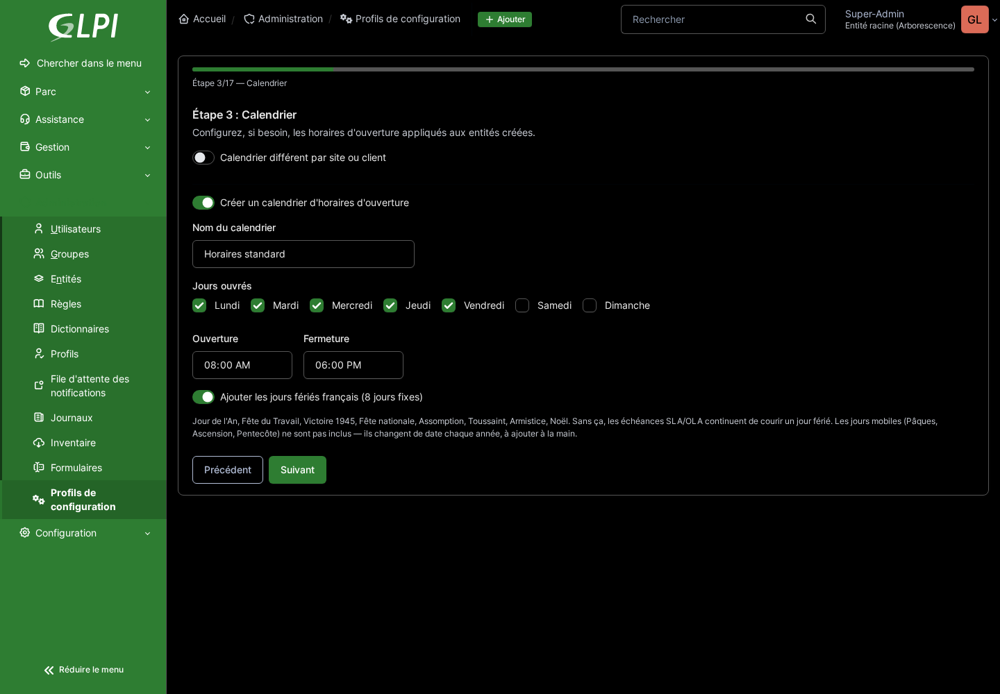

## Étape 4 — SLA

Seuils de résolution par priorité (SLA côté demandeur) et engagements internes (OLA), avec
escalade automatique N1 → N2 → N3 configurable.

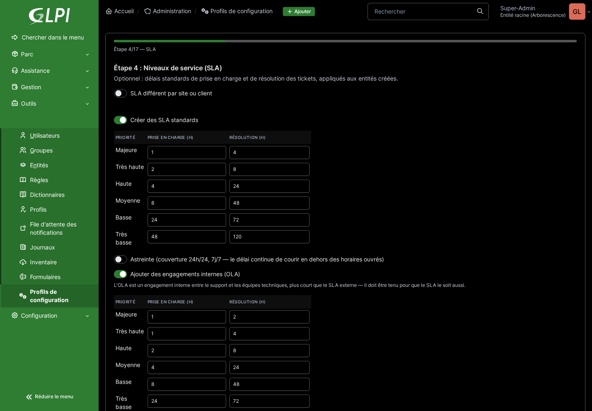

## Étape 5 — Catégories

Arborescence de catégories de tickets sur 3 niveaux, organisée par thème métier (IT, Bâtiment,
RH...). Chaque branche de premier niveau est sélectionnable indépendamment — une organisation sans
flotte automobile ou maintenance industrielle n'a pas à les garder.

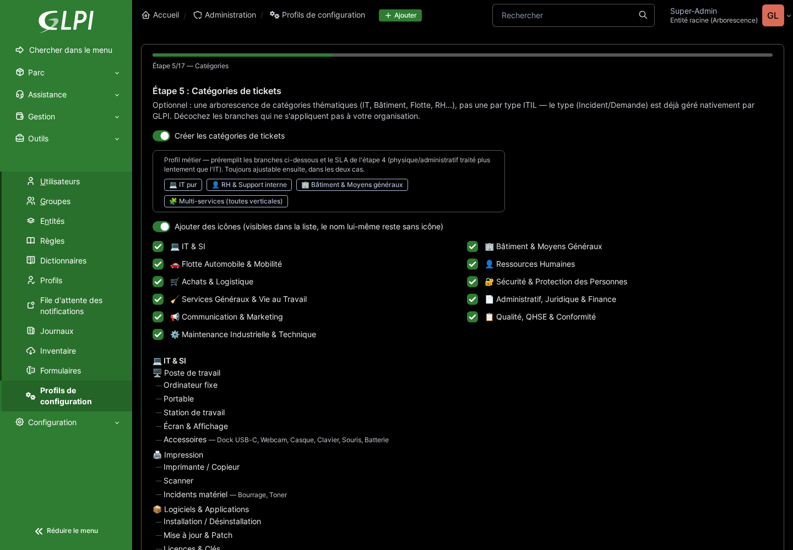

## Étape 6 — Catalogue de services

Génère un catalogue en libre-service (formulaires GLPI natifs) à partir des catégories
sélectionnées à l'étape précédente : chaque service route automatiquement vers la bonne catégorie,
sans que l'utilisateur final ait à la choisir lui-même.

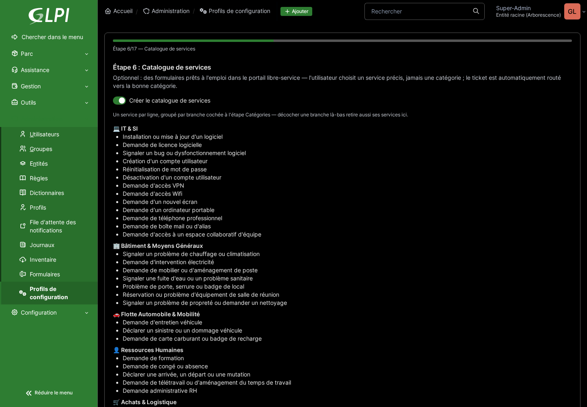

## Étape 7 — Statuts

Statuts d'éléments du parc (En stock, Affecté, En panne...), avec sélection individuelle de ceux à
créer.

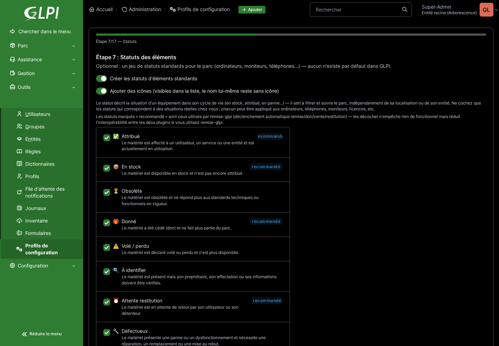

## Étape 8 — Raisons d'attente

Raisons de mise en attente d'un ticket, chacune pouvant déclencher automatiquement un modèle de
suivi et une fréquence de relance.

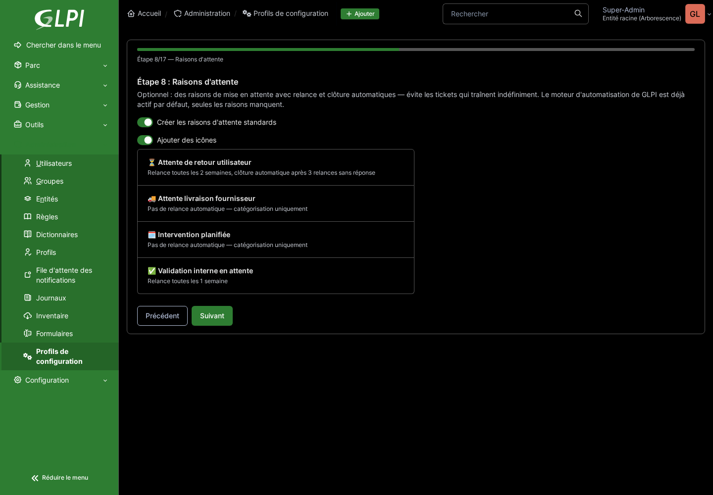

## Étape 9 — Personnalisation

Couleur principale et logo, appliqués à l'interface GLPI — partagés pour toute l'instance ou
différenciés par client/site en mode multi-entité. Aperçu en direct de l'en-tête GLPI pendant le
réglage.

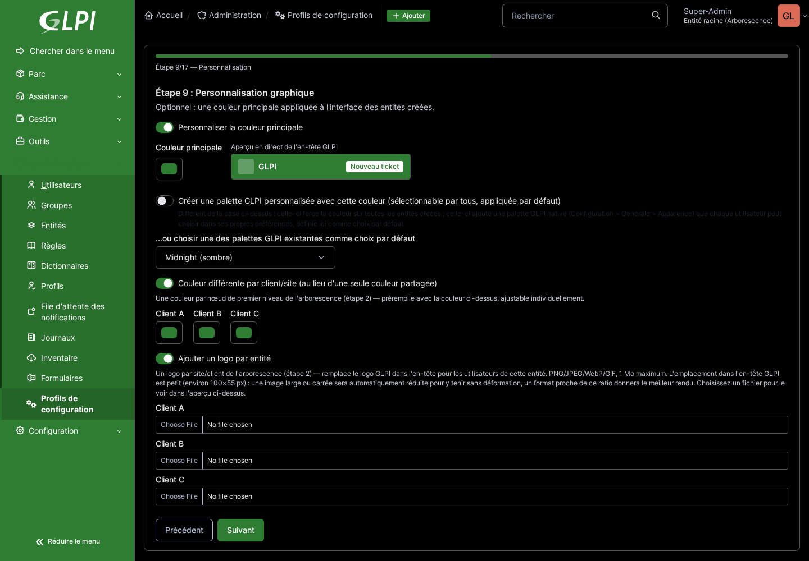

## Étape 10 — Réglages généraux

Bascule des paramètres GLPI natifs recommandés : notifications, tâches automatiques, champs
masqués sur les formulaires en libre-service...

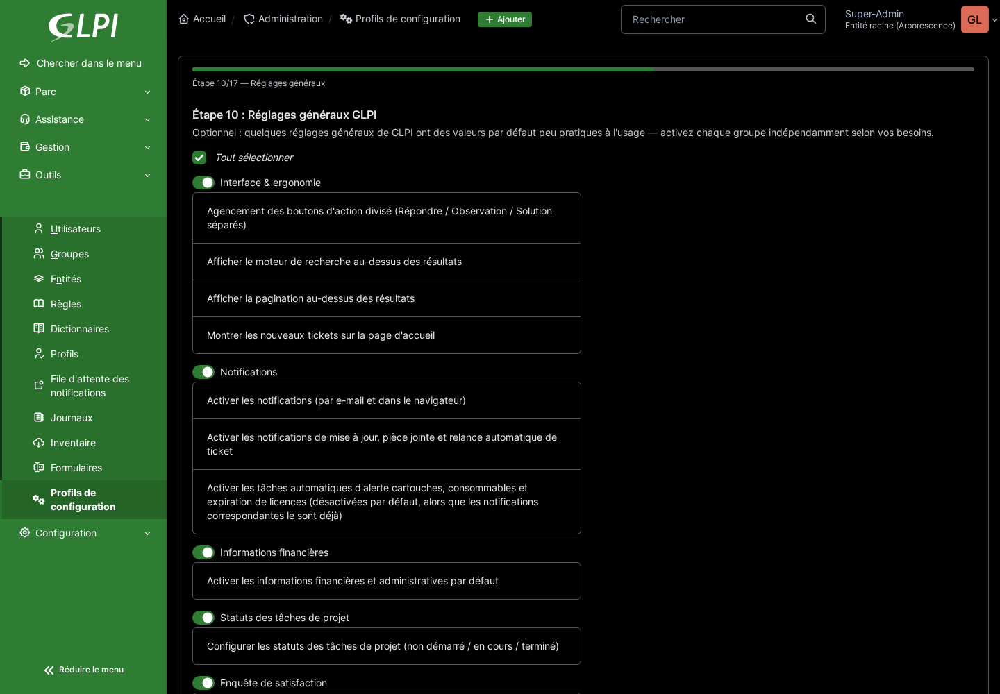

## Étape 11 — Modèles de tickets

Deux modèles de ticket assignés automatiquement selon le profil GLPI de l'utilisateur : un
simplifié (titre + description) pour les profils de base, un complet (catégorie et urgence
obligatoires) pour le personnel technique.

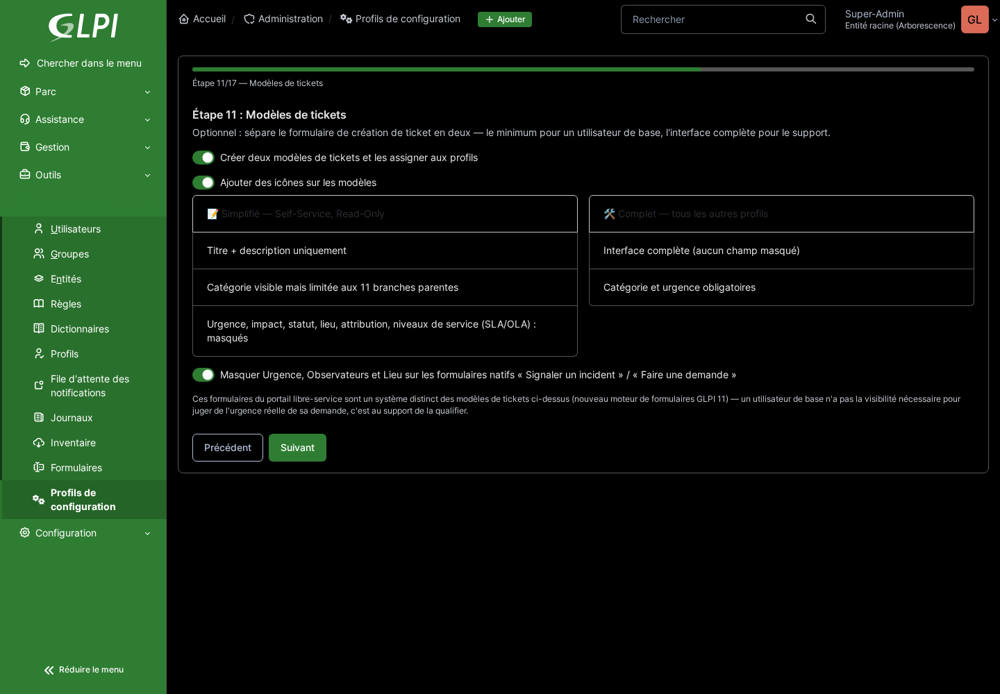

## Étape 12 — Droits LDAP

Optionnel : règles d'affectation automatique entité + profil par site lors d'une synchronisation
LDAP/AD, plus des règles par fonction/département indépendantes du site (ex. le groupe AD
« Finance » reçoit toujours tel profil, quel que soit le site de l'utilisateur).

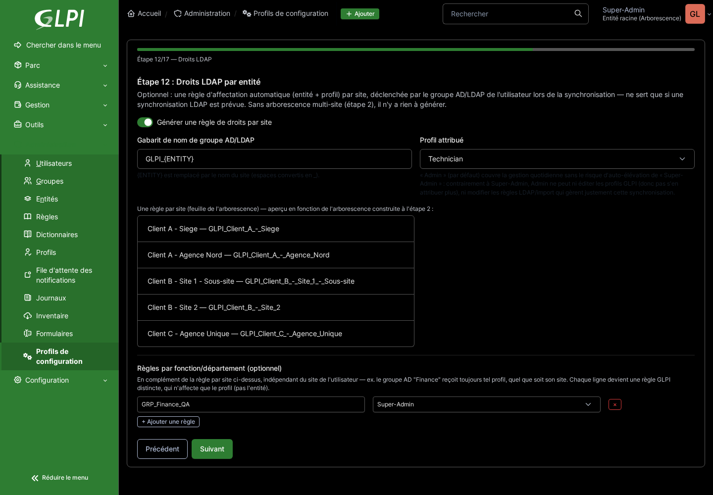

## Étape 13 — Tâches & solutions

Bibliothèque de gabarits de tâches et de solutions réutilisables, classés par type (assistance,
résolution technique, sécurité, gestion des accès...), avec une salutation personnalisée générée
dynamiquement à partir du demandeur réel du ticket.

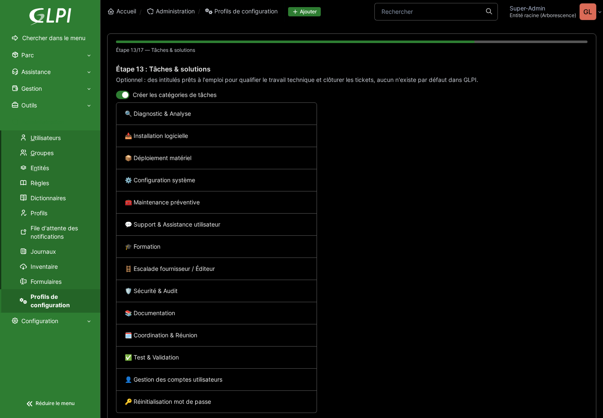

## Étape 14 — Suivis & validations

Gabarits de suivis (messages de relance/notification réutilisables) et étapes de validation
(hiérarchique, technique, comité...).

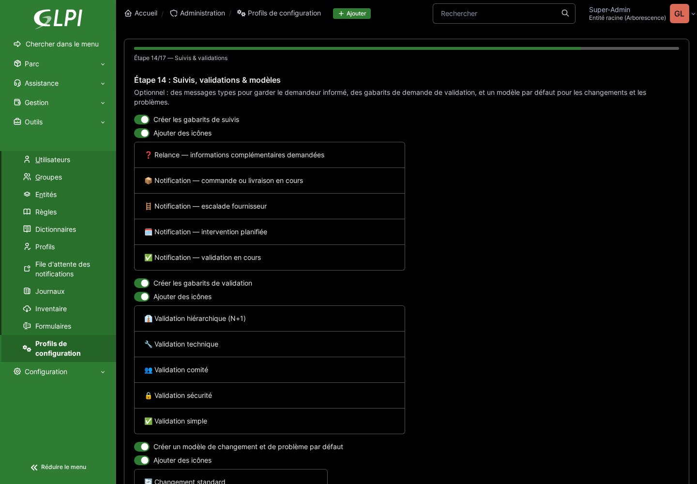

## Étape 15 — Général & Outils

Intitulés transverses : lieux (calqués sur l'arborescence d'entités), fabricants, catégories de la
base de connaissances, rubriques documentaires (classification ISO 27001).

## Étape 16 — Projets

Types de projet et de tâche de projet, gabarits de tâches de projet, catégories et gabarits
d'évènements de planning.

## Étape 17 — Récapitulatif

Dernière étape avant la création réelle : relit tous les choix des 16 étapes précédentes. Rien
n'est créé dans GLPI avant de valider ici.

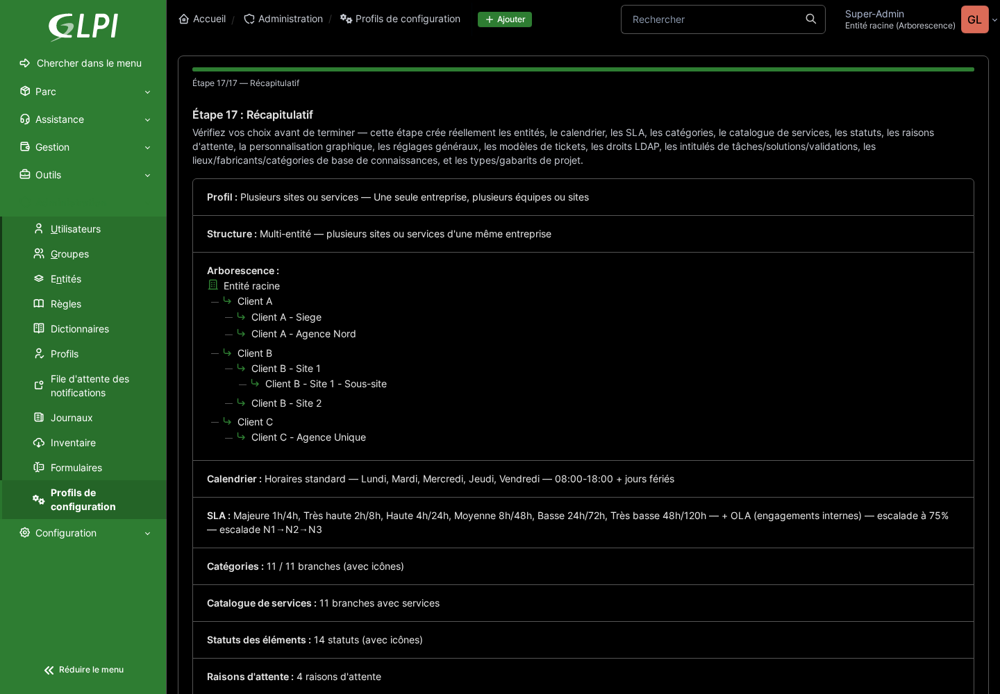

---

Pour le détail technique de chaque fonctionnalité (ce qui est généré, pourquoi, et les décisions
prises en cours de route), voir [CHANGELOG.md](../CHANGELOG.md) et [ROADMAP.md](../ROADMAP.md).
