[🇫🇷 Français](#-français) · [🇬🇧 English](#-english)

## 🇫🇷 Français

**Tutoriel — Utilisation de l'assistant**

Configurer une instance GLPI neuve à la main — entités, calendrier, SLA, catégories, statuts,
modèles, droits, personnalisation — prend habituellement plusieurs jours à un administrateur qui
découvre l'outil, avec le risque d'oublier un réglage important en cours de route. Cet assistant
condense ce travail en 18 étapes guidées : vous répondez à des questions sur votre organisation,
il construit la configuration correspondante, et vous voyez le résultat avant qu'il ne soit
appliqué. Ce tutoriel parcourt chacune de ces 18 étapes, avec une capture d'écran de chacune, pour
que vous sachiez exactement à quoi vous attendre — même avant d'avoir installé le plugin.

Les captures ci-dessous montrent le profil **« Plusieurs sites ou services »** — les
autres profils (Installation simple, Plusieurs entreprises clientes/MSP, Personnalisé)
pré-remplissent les mêmes étapes différemment, mais la structure du parcours est identique.

À tout moment, vous pouvez revenir en arrière avec **Précédent** sans perdre vos réponses : rien
n'est enregistré dans GLPI avant l'étape 18 (Récapitulatif). Vous pouvez donc parcourir tout
l'assistant pour voir ce qu'il propose, sans risque, avant de décider de valider quoi que ce soit.

### Étape 1 — Profil

Le point de départ : quatre profils prédéfinis (PME/ETI mono-site, plusieurs sites ou services,
plusieurs entreprises clientes/MSP, ou personnalisé). Le choix pré-remplit la structure d'entités,
le calendrier et les SLA des étapes suivantes avec des valeurs adaptées — tout reste ajustable
ensuite, aucun choix n'est définitif. Un bouton **mode express** permet aussi de valider directement
avec les valeurs par défaut du profil choisi, sans parcourir les 18 étapes une à une : pour une
installation simple, une instance opérationnelle en quelques secondes plutôt qu'en 17 étapes
supplémentaires.

### Étape 2 — Entités

Construit l'arborescence d'entités : mono-entité, multi-site (une entreprise, plusieurs
sites/équipes), ou MSP (plusieurs entreprises clientes distinctes). Un nœud par site, profondeur
libre — l'aperçu à droite se met à jour en direct à chaque ajout, sans rien enregistrer tant que
vous n'avez pas validé le récapitulatif final. C'est cette structure qui, plus tard, permettra de
différencier calendrier, SLA, logo ou droits par site ou par client, sans avoir à gérer plusieurs
instances GLPI séparées.

### Étape 3 — Lieux

Optionnel : associez une adresse (rue, ville, coordonnées GPS, alias, téléphone...) à n'importe
quelle entité de l'arborescence construite à l'étape précédente, à n'importe quelle profondeur.
Aucune adresse saisie, aucun lieu créé — comme sur une installation GLPI neuve. Un assistant
d'adresse optionnel (Nominatim/OpenStreetMap) propose des suggestions de rue pendant la saisie une
fois la ville et le pays renseignés, pour éviter les fautes de frappe qui rendraient une adresse
inexploitable sur une carte. Chaque entité peut aussi avoir des lieux enfants (bâtiment,
étage, salle...), et sa propre fiche adresse native GLPI (Entités > Adresse) peut être complétée en
même temps avec les mêmes coordonnées, plus téléphone/fax/site web/e-mail.

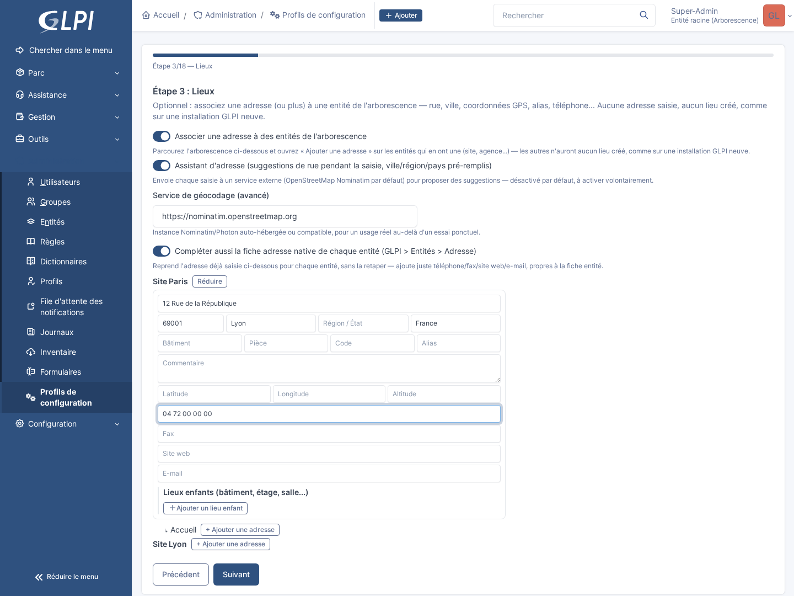

### Étape 4 — Calendrier

Horaires d'ouverture et jours fériés français, utilisés ensuite par les SLA pour calculer les
délais réels (hors horaires non ouvrés) — sans ce réglage, un SLA "résolution sous 4h" décompterait
aussi les nuits et les week-ends, ce qui n'aurait aucun sens opérationnel.

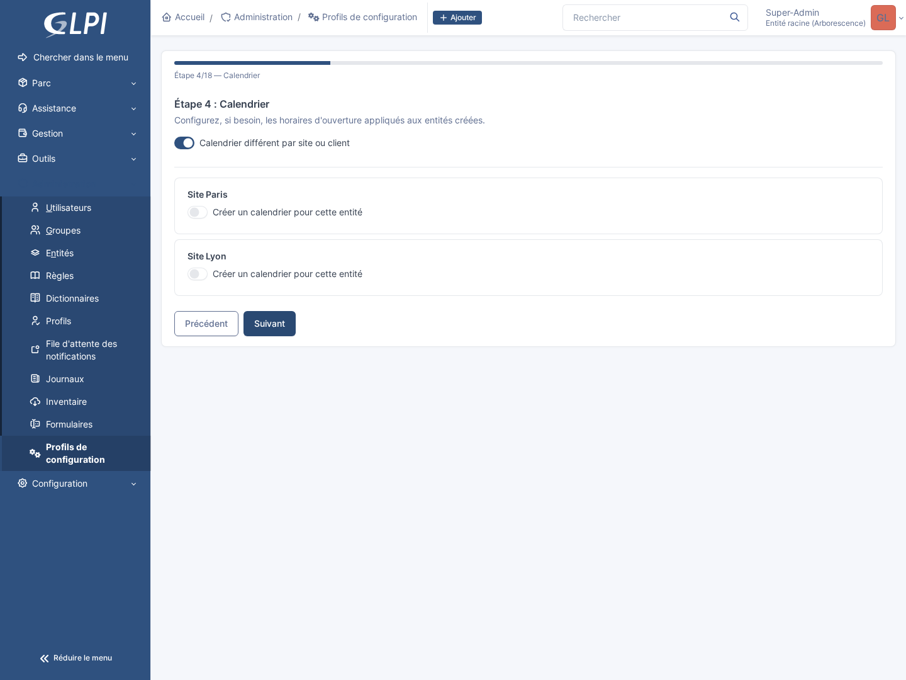

### Étape 5 — SLA

Seuils de résolution par priorité (SLA côté demandeur) et engagements internes (OLA), avec
escalade automatique N1 → N2 → N3 configurable : un ticket qui traîne remonte tout seul au niveau
de support supérieur avant que le délai ne soit dépassé, plutôt que de compter sur un technicien
qui surveille le tableau de bord en permanence.

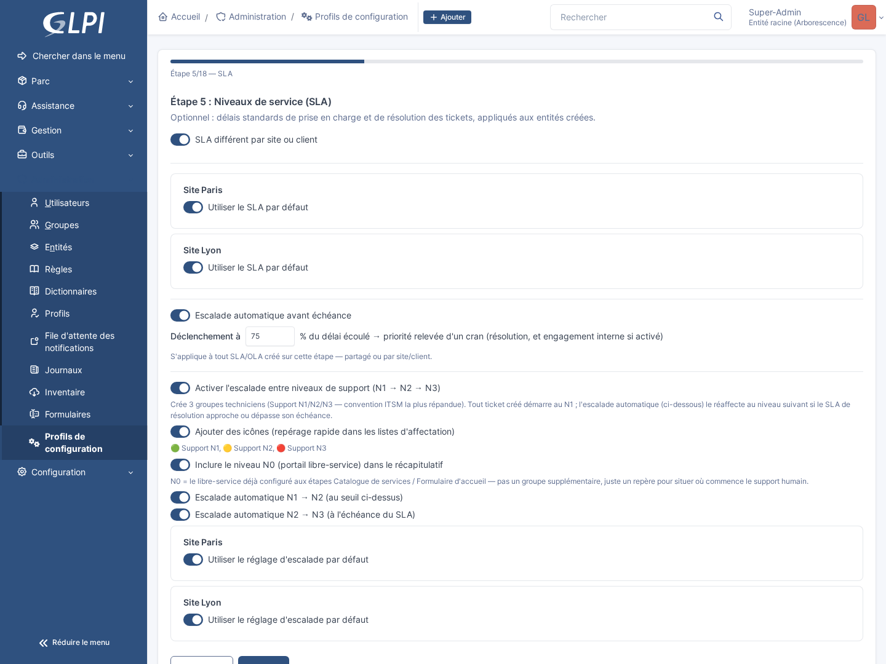

### Étape 6 — Catégories

Arborescence de catégories de tickets sur 3 niveaux, organisée par thème métier (IT, Bâtiment,
RH...). Chaque branche de premier niveau est sélectionnable indépendamment — une organisation sans
flotte automobile ou maintenance industrielle n'a pas à les garder, plutôt que de devoir supprimer
à la main des dizaines de catégories inutiles après coup.

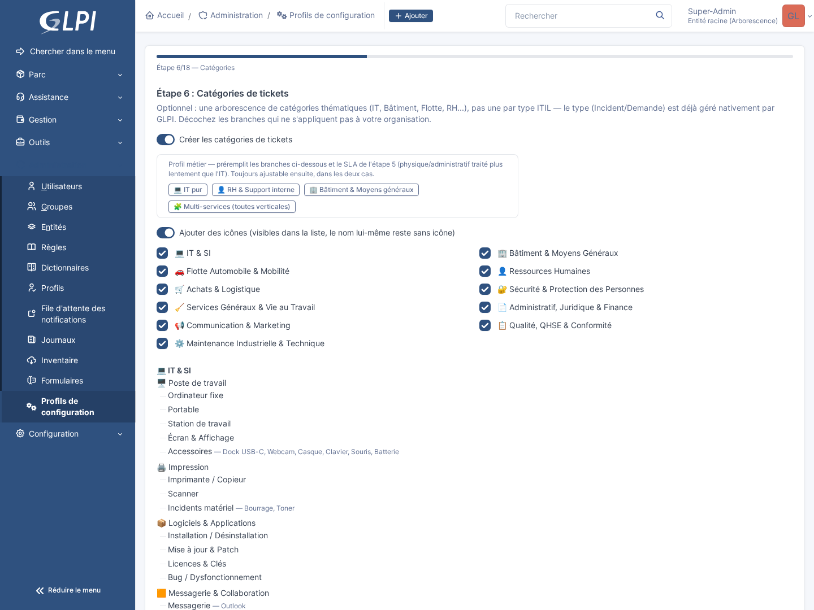

### Étape 7 — Catalogue de services

Génère un catalogue en libre-service (formulaires GLPI natifs) à partir des catégories
sélectionnées à l'étape précédente : chaque service route automatiquement vers la bonne catégorie,
sans que l'utilisateur final ait à la choisir lui-même — il décrit son besoin en langage courant
("mon écran ne s'allume plus"), pas en jargon de classification ITIL.

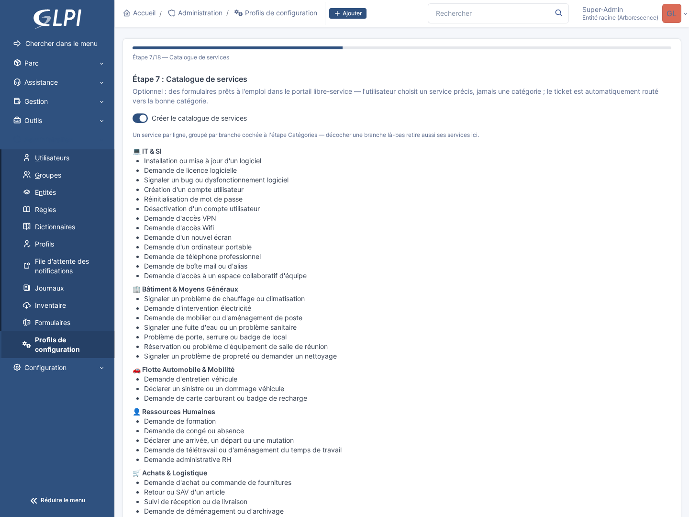

### Étape 8 — Statuts

Statuts d'éléments du parc (En stock, Affecté, En panne...), avec sélection individuelle de ceux à
créer — la base d'un inventaire exploitable, où chaque matériel a un état clair plutôt qu'une
colonne vide.

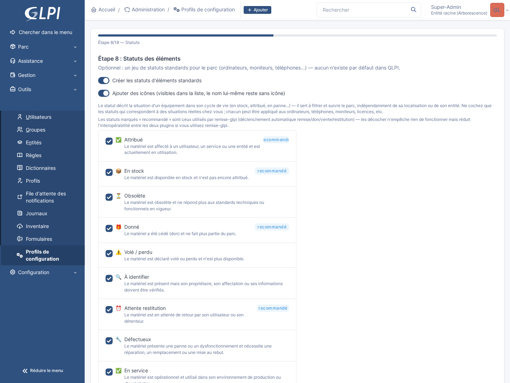

### Étape 9 — Raisons d'attente

Raisons de mise en attente d'un ticket, chacune pouvant déclencher automatiquement un modèle de
suivi et une fréquence de relance — un ticket "en attente de pièce" relance le demandeur tout seul
au bon rythme, sans qu'un technicien n'ait à s'en souvenir.

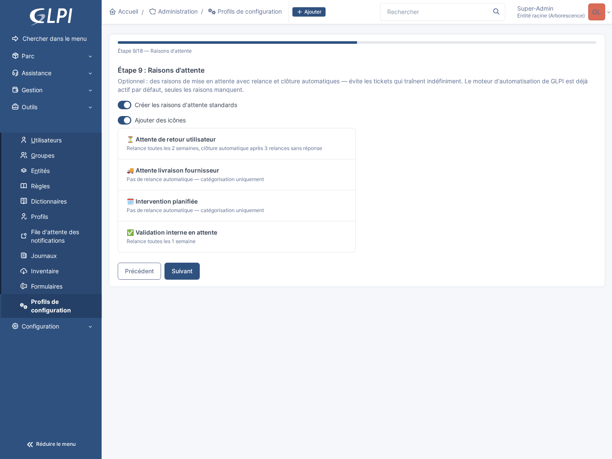

### Étape 10 — Modèles de tickets

Deux modèles de ticket assignés automatiquement selon le profil GLPI de l'utilisateur : un
simplifié (titre + description) pour les profils de base, un complet (catégorie et urgence
obligatoires) pour le personnel technique — chacun voit un formulaire adapté à son niveau, sans
configuration supplémentaire.

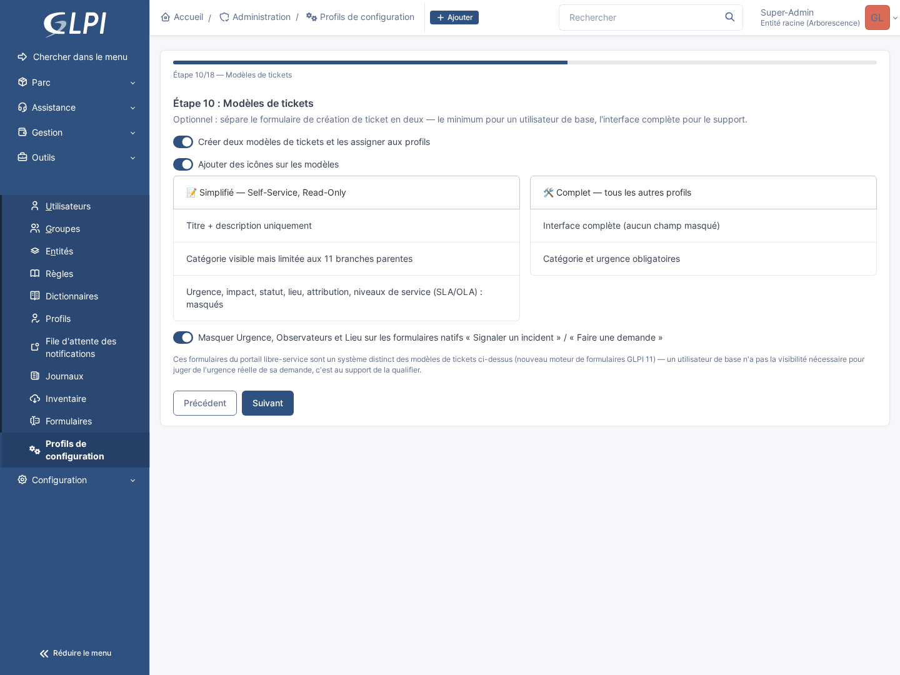

### Étape 11 — Tâches & solutions

Bibliothèque de gabarits de tâches et de solutions réutilisables, classés par type (assistance,
résolution technique, sécurité, gestion des accès...), avec une salutation personnalisée générée
dynamiquement à partir du demandeur réel du ticket — un technicien insère un gabarit et obtient
un texte déjà personnalisé, pas un texte générique à retoucher à la main à chaque fois.

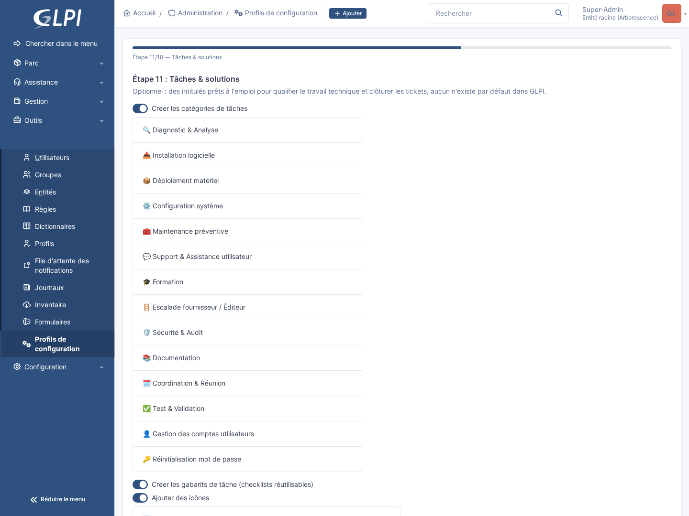

### Étape 12 — Suivis, validations & modèles

Gabarits de suivis (messages de relance/notification réutilisables), étapes de validation
(hiérarchique, technique, comité...), et modèles de changement/problème — de quoi couvrir les
processus ITIL Change/Problem Management dès le premier jour, sans les construire de zéro.

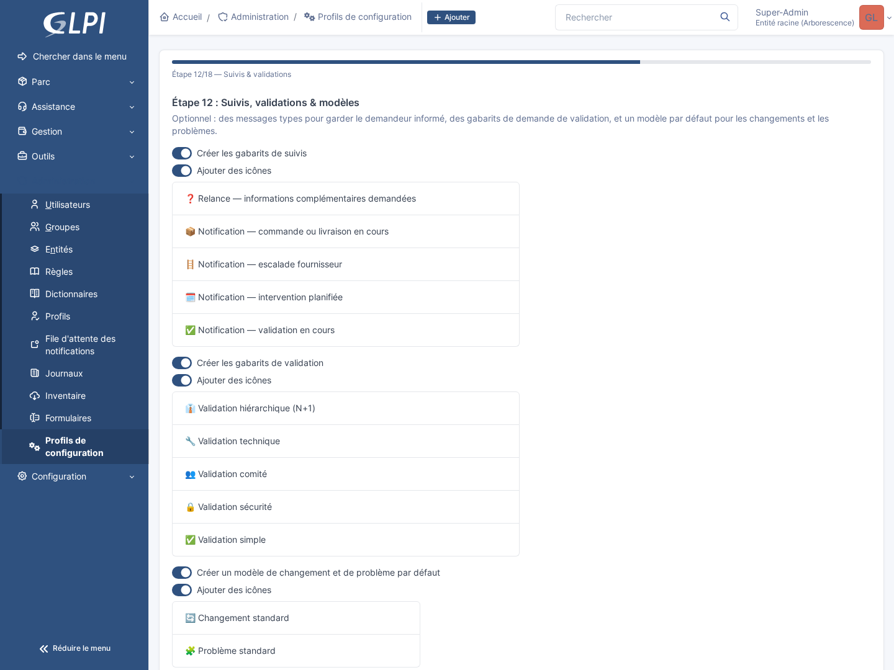

### Étape 13 — Droits LDAP par entité

Optionnel : règles d'affectation automatique entité + profil par site lors d'une synchronisation
LDAP/AD, plus des règles par fonction/département indépendantes du site (ex. le groupe AD
« Finance » reçoit toujours tel profil, quel que soit le site de l'utilisateur) — un nouvel
utilisateur synchronisé depuis l'annuaire arrive déjà au bon endroit avec les bons droits, sans
intervention manuelle d'un administrateur GLPI.

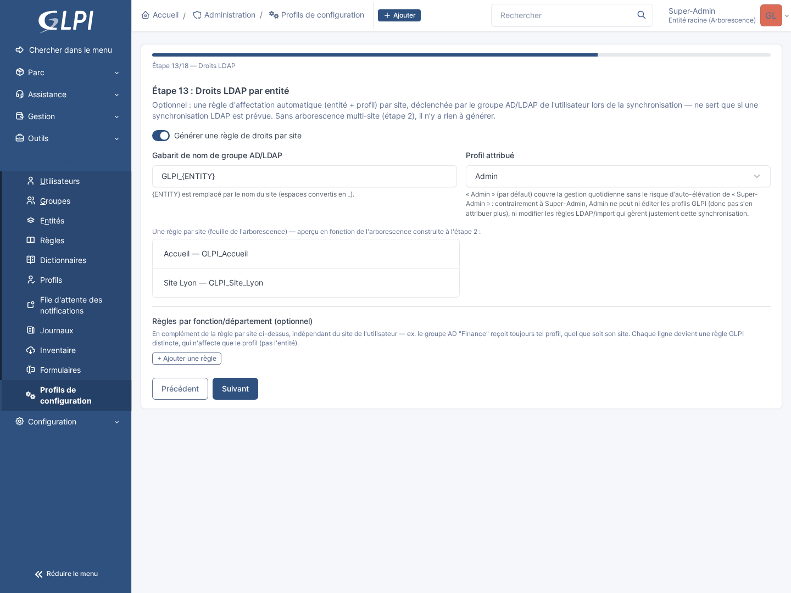

### Étape 14 — Réglages généraux GLPI

Bascule des paramètres GLPI natifs recommandés : notifications, tâches automatiques, champs
masqués sur les formulaires en libre-service... des réglages que la documentation officielle de
GLPI recommande, mais qu'il faut connaître et retrouver un par un dans un menu par ailleurs très
dense.

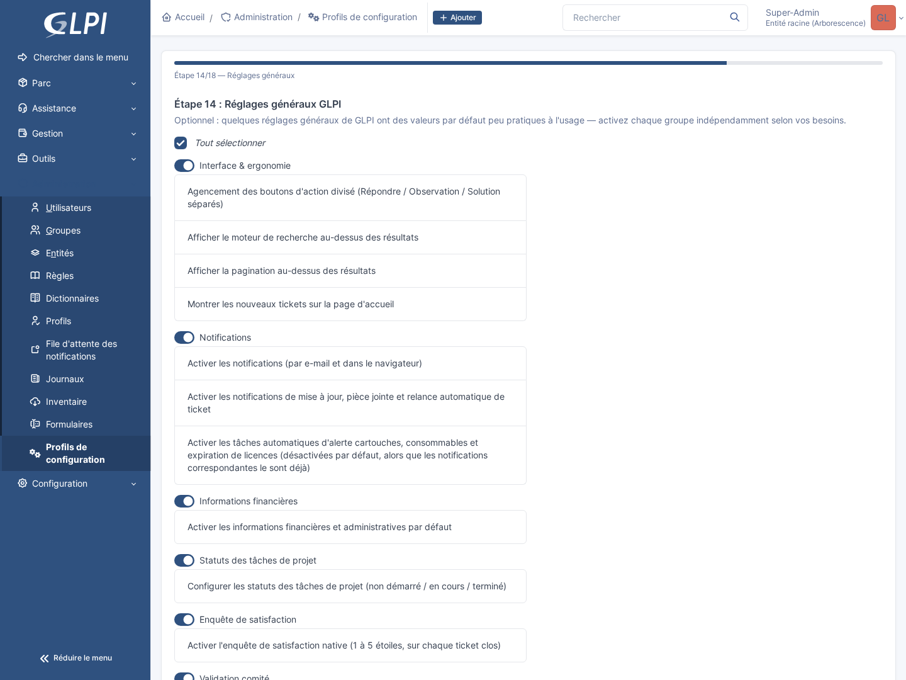

### Étape 15 — Général & Outils

Intitulés transverses : fabricants, sources de demande, catégories d'utilisateurs, catégories de
la base de connaissances, rubriques documentaires (classification ISO 27001), évènements de
planning — le socle d'intitulés dont dépendent presque tous les autres modules de GLPI.

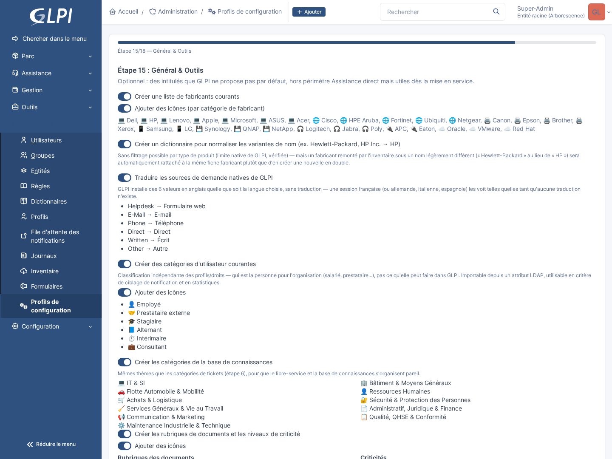

### Étape 16 — Projets

Types de projet et de tâche de projet, gabarits de tâches de projet, modèles de projet, catégories
et gabarits d'évènements de planning — pour piloter des projets internes (déploiement, migration...)
depuis GLPI plutôt que dans un tableur séparé.

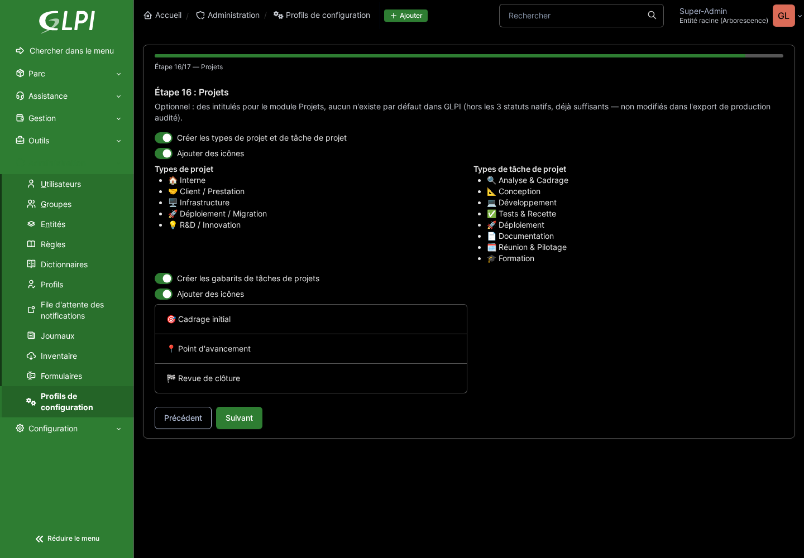

### Étape 17 — Personnalisation graphique

Couleur principale et logo, appliqués à l'interface GLPI — partagés pour toute l'instance ou
différenciés par client/site en mode multi-entité, pour qu'un client MSP reconnaisse ses propres
couleurs plutôt que celles d'un concurrent hébergé sur la même instance. Aperçu en direct de l'en-tête
GLPI pendant le réglage. Placée en dernier dans le parcours : c'est la partie la moins importante,
purement esthétique, qui ne doit pas retarder les réglages fonctionnels qui précèdent.

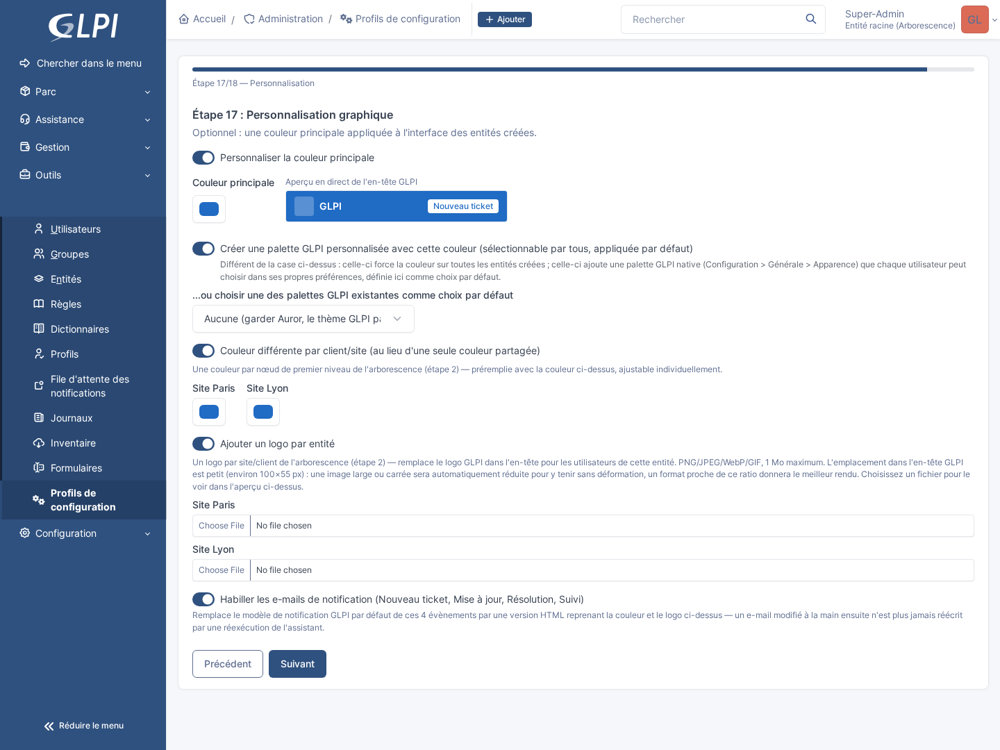

### Étape 18 — Récapitulatif

Dernière étape avant la création réelle : relit tous les choix des 17 étapes précédentes. Rien
n'est créé dans GLPI avant de valider ici — c'est le tout premier moment de tout le parcours où
quelque chose est réellement écrit en base.

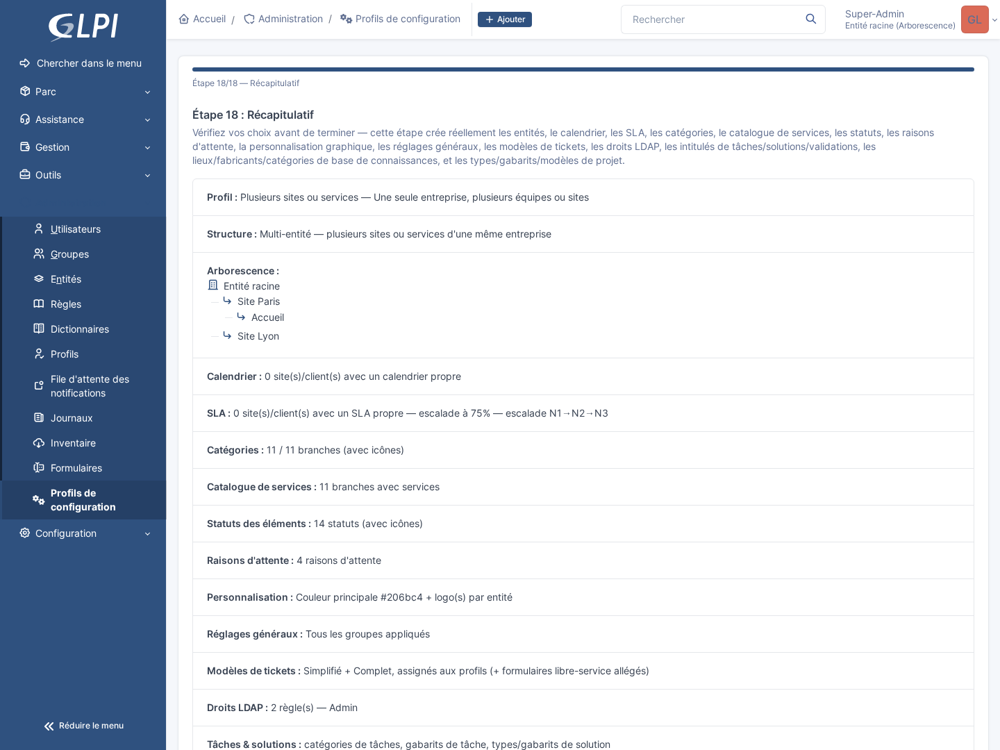

### Et ensuite ?

Une fois le récapitulatif validé, l'instance GLPI est immédiatement opérationnelle : entités,
calendrier, SLA, catégories, catalogue de services, statuts, modèles et droits sont en place et
utilisables dès la prochaine connexion — pas besoin de redémarrer GLPI ni d'attendre une tâche
planifiée. Vous pouvez relancer l'assistant à tout moment (par exemple pour ajouter un nouveau
site ou ajuster un SLA) : les réglages déjà en place ne sont pas dupliqués, seuls les éléments
manquants sont créés.

Pour le détail technique de chaque fonctionnalité (ce qui est généré, pourquoi, et les décisions
prises en cours de route), voir [CHANGELOG.md](../CHANGELOG.md) et [ROADMAP.md](../ROADMAP.md).

## 🇬🇧 English

**Tutorial — Using the wizard**

Configuring a fresh GLPI instance by hand — entities, calendar, SLAs, categories, statuses,
templates, rights, customization — usually takes a newcomer administrator several days, with the
risk of missing something important along the way. This wizard condenses that work into 18 guided
steps: you answer questions about your organization, it builds the matching configuration, and you
see the result before it's applied. This tutorial walks through each of these 18 steps, with a
screenshot of each, so you know exactly what to expect — even before installing the plugin.

The screenshots below show the **"Multiple sites or departments"** profile — the other profiles
(Simple install, Multiple client companies/MSP, Custom) pre-fill the same steps differently, but
the flow's structure is identical.

At any point, you can go back with **Previous** without losing your answers: nothing is saved to
GLPI before step 18 (Summary). So you can go through the whole wizard to see what it proposes, risk
free, before deciding to confirm anything.

### Step 1 — Profile

The starting point: four predefined profiles (single-site SMB, multiple sites or departments,
multiple client companies/MSP, or custom). The choice pre-fills the entity structure, calendar and
SLAs of the following steps with values suited to it — everything remains adjustable afterwards,
no choice is final. An **express mode** button also lets you confirm directly with the chosen
profile's default values, without going through all 18 steps one by one: for a simple install, an
operational instance in a few seconds rather than 17 more steps.

### Step 2 — Entities

Builds the entity tree: single entity, multi-site (one company, several sites/teams), or MSP
(several distinct client companies). One node per site, unlimited depth — the preview on the right
updates live with every addition, with nothing saved until you confirm the final summary. It's this
structure that later lets you differentiate the calendar, SLAs, logo or rights per site or per
client, without having to manage several separate GLPI instances.

### Step 3 — Locations

Optional: attach an address (street, city, GPS coordinates, alias, phone...) to any entity in the
tree built in the previous step, at any depth. No address entered, no location created — same as
on a fresh GLPI install. An optional address helper (Nominatim/OpenStreetMap) suggests streets as
you type once the city and country are filled in, to avoid typos that would make an address
unusable on a map. Each entity can also have child locations (building, floor, room...), and its
own native GLPI address record (Entities > Address) can be filled in at the same time with the same
details, plus phone/fax/website/e-mail.

### Step 4 — Calendar

Business hours and French public holidays, used afterwards by the SLAs to compute real deadlines
(excluding non-working hours) — without this setting, a "resolve within 4h" SLA would also count
nights and weekends, which would make no operational sense.

### Step 5 — SLA

Resolution thresholds per priority (requester-side SLA) and internal commitments (OLA), with
configurable automatic L1 → L2 → L3 escalation: a ticket that's stalling escalates itself to the
next support tier before the deadline is missed, rather than relying on a technician watching the
dashboard constantly.

### Step 6 — Categories

A 3-level ticket category tree, organized by business topic (IT, Facilities, HR...). Each
top-level branch can be selected independently — an organization with no vehicle fleet or
industrial maintenance doesn't have to keep those, rather than having to manually delete dozens of
unused categories afterwards.

### Step 7 — Service catalog

Generates a self-service catalog (native GLPI forms) from the categories selected in the previous
step: each service automatically routes to the right category, with no need for the end user to
choose it themselves — they describe their need in plain language ("my monitor won't turn on"),
not in ITIL classification jargon.

### Step 8 — Statuses

Asset statuses (In stock, Assigned, Out of order...), with individual selection of which ones to
create — the basis of a usable inventory, where every asset has a clear status rather than an
empty column.

### Step 9 — Pending reasons

Reasons for putting a ticket on hold, each able to automatically trigger a follow-up template and
a reminder frequency — a ticket "waiting for a part" follows up with the requester on its own, at
the right pace, with no technician having to remember to do it.

### Step 10 — Ticket templates

Two ticket templates automatically assigned based on the user's GLPI profile: a simplified one
(title + description) for basic profiles, a full one (category and urgency mandatory) for
technical staff — everyone sees a form suited to their level, with no extra configuration.

### Step 11 — Tasks & solutions

A library of reusable task and solution templates, classified by type (support, technical
resolution, security, access management...), with a personalized greeting dynamically generated
from the ticket's actual requester — a technician inserts a template and gets text that's already
personalized, not generic text to rework by hand every time.

### Step 12 — Follow-ups, validations & templates

Follow-up templates (reusable reminder/notification messages), validation steps (hierarchical,
technical, committee...), and change/problem templates — enough to cover ITIL Change/Problem
Management processes from day one, without building them from scratch.

### Step 13 — LDAP rights per entity

Optional: rules for automatically assigning an entity + profile per site during an LDAP/AD sync,
plus site-independent rules per role/department (e.g. the AD "Finance" group always gets a given
profile, regardless of the user's site) — a new user synced from the directory already lands in
the right place with the right rights, with no manual intervention from a GLPI administrator.

### Step 14 — General GLPI settings

Toggling of recommended native GLPI settings: notifications, automatic actions, fields hidden on
self-service forms... settings that GLPI's own official documentation recommends, but that you'd
otherwise have to know about and find one by one in an already very dense menu.

### Step 15 — General & Tools

Cross-cutting dropdowns: manufacturers, request sources, user categories, knowledge base
categories, document topics (ISO 27001 classification), calendar events — the base set of
dropdowns that almost every other GLPI module depends on.

### Step 16 — Projects

Project and project task types, project task templates, project templates, calendar event
categories and templates — for running internal projects (rollout, migration...) from GLPI rather
than in a separate spreadsheet.

### Step 17 — Visual customization

Primary color and logo, applied to the GLPI interface — shared across the whole instance or
differentiated per client/site in multi-entity mode, so an MSP client recognizes their own colors
rather than a competitor's hosted on the same instance. Live preview of the GLPI header while
adjusting it. Placed last in the flow: this is the least important part, purely cosmetic, and it
shouldn't delay the functional settings that come before it.

### Step 18 — Summary

The last step before actual creation: reviews every choice made in the previous 17 steps. Nothing
is created in GLPI before confirming here — this is the very first moment in the whole flow where
anything is actually written to the database.

### What happens next?

Once the summary is confirmed, the GLPI instance is immediately operational: entities, calendar,
SLAs, categories, service catalog, statuses, templates and rights are in place and usable from the
next login — no need to restart GLPI or wait for a scheduled task. You can re-run the wizard at
any time (for example to add a new site or adjust an SLA): settings already in place aren't
duplicated, only missing elements are created.

For the technical detail of each feature (what gets generated, why, and the decisions made along
the way), see [CHANGELOG.md](../CHANGELOG.md) and [ROADMAP.md](../ROADMAP.md).
